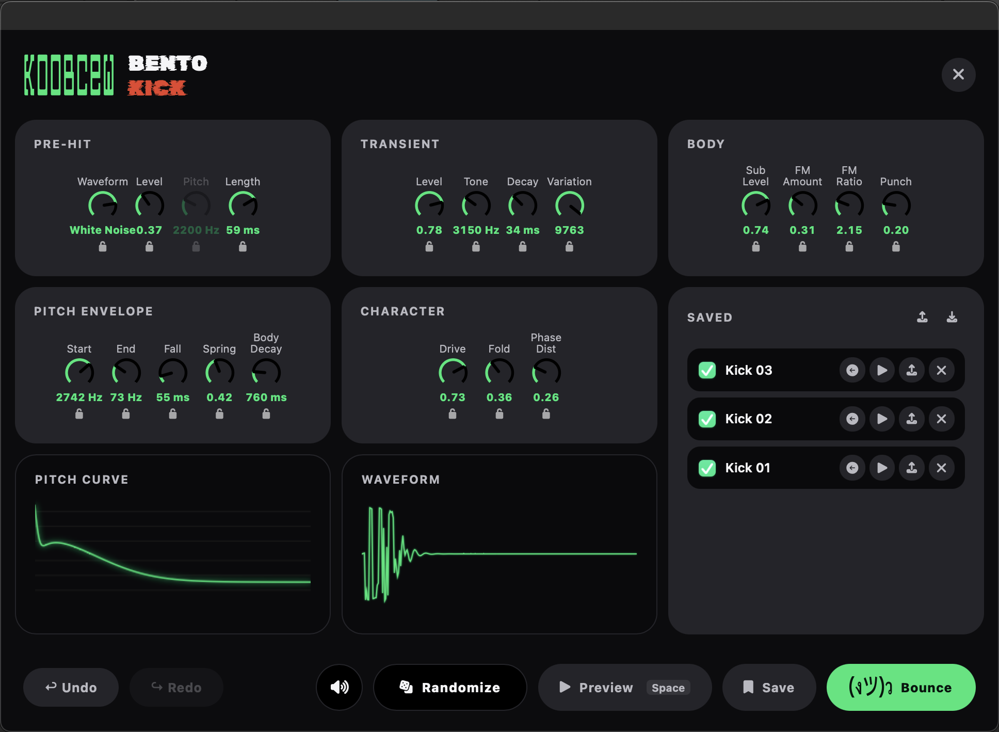
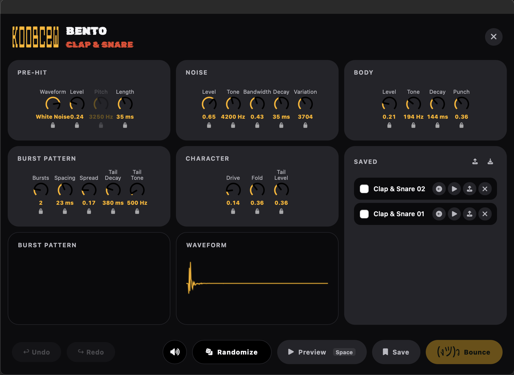

# Ableton Extensions

This project collects all the Ableton Extensions made by KOOBCeW.

## Setup

1. In Ableton Live, open **Settings → Extensions**.
2. Load the extension's `.ablx` file.
3. Restart Ableton Live.
4. Right-click on a MIDI or audio track (in Session View / Clip View or Arrangement View) to open the context menu.
5. Select the desired extension, e.g. **Bento Kick: Fresh Meal**.

When bouncing/exporting sounds, the extension renders the audio and places the resulting clip(s) directly on the selected track or clip slot — no extra steps needed.

## Available extensions:

### Bento Kick
synthesizes fully shaped kick drums directly inside Ableton Live, with 14 parameters covering pitch envelope, feedback FM, phase distortion, sub oscillator and noise driven transient shaping.

Download: [Releases](https://github.com/KOOBCeW/ableton-extensions/releases?q=bento-kick)

### Bento Clap & Snare
synthesizes claps and snares directly inside Ableton Live, shaping multi-burst noise patterns, a noise tail and a tonal body, with controls for burst count/spacing/spread, tone, bandwidth, decay, drive, fold and pre-hit.

Download: [Releases](https://github.com/KOOBCeW/ableton-extensions/releases?q=bento-clap-and-snare)

